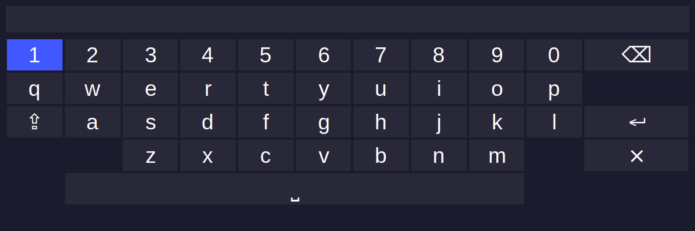

# Transparent Keyboard

A customizable, transparent virtual keyboard implementation in Python using Tkinter.

## Overview

### Purpose

Transparent Keyboard is a specialized virtual keyboard designed for scenarios where a physical keyboard is inconvenient, particularly when using a PC remote. Its core functionality allows users to bind the keyboard launch to a shortcut, enabling quick text input and immediate pasting into the previously focused application.

### Use Case

Ideal for media centers, home theater PCs, or any setup controlled primarily by a remote control. With a single shortcut setup to launch the keyboard, users can:
- Launch a transparent keyboard using their PC remote
- Type text directly
- Automatically paste the text into whatever application was active before launching the keyboard

This eliminates the need to have a remote with a dedicated physical keyboard.

## Features

- Transparent, draggable window
- QWERTY keyboard layout with special keys
- Keyboard navigation support using arrow keys
- Caps lock functionality
- Copy and paste support
- Modern UI with customizable appearance through settings

## Requirements

- Python 3.x
- tkinter
- pyperclip

## Installation

1. Clone the repository:
```bash
git clone https://github.com/yourusername/transparent-keyboard.git
cd transparent-keyboard
```

2. Install the required dependencies:
```bash
pip install -r requirements.txt
```

## Usage

Run the keyboard application:
```bash
python transparent_keyboard.py [options]
```

### Command Line Arguments

- `--x`: Window X position (default: 100)
- `--y`: Window Y position (default: 100)
- `--width`: Window width (default: 1200)
- `--height`: Window height (default: 400)

Example:
```bash
python transparent_keyboard.py --x 200 --y 300 --width 1000 --height 350
```

## Project Screenshot



## Configuration

The keyboard appearance and behavior can be customized through the `transparent_keyboard_settings.py` file.

## License

This project is licensed under the MIT License - see the [LICENSE](LICENSE) file for details.

## Contributing

Contributions are welcome! Please feel free to submit a Pull Request.

{{ ... }}
